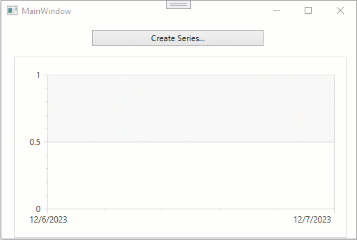

<!-- default badges list -->

<!-- default badges end -->

# Chart for WPF - How to Enable Animation for a Series Template

This example demonstrates how to animate series that are populated with series templates.

## Files to Review

* [MainWindow.xaml](./CS/MainWindow.xaml) (VB: [MainWindow.xaml](./VB/MainWindow.xaml))
* [MainWindow.xaml.cs](./CS/MainWindow.xaml.cs) (VB: [MainWindow.xaml.vb](./VB/MainWindow.xaml.vb))

## Documentation

* [Animate Series](https://docs.devexpress.com/WPF/14635/controls-and-libraries/charts-suite/chart-control/animation/animate-series)

<!-- feedback -->
## Does this example address your development requirements/objectives?

 

(you will be redirected to DevExpress.com to submit your response)
<!-- feedback end -->
